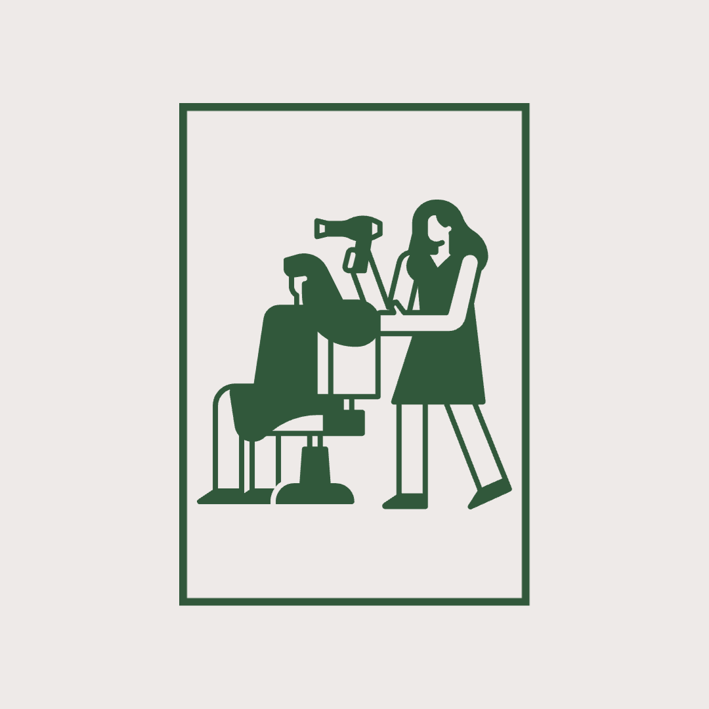

<div align="center">
  
  <h1>Vicious Streak Salon</h1>
</div>

## Demo

[Vicious Streak Salon - Live](https://viciousstreaksalon.com)

## Desktop and Mobile Screenshots

[Screenshots](https://github.com/AsarelCastellanos/salon/blob/main/SCREENSHOTS.md)

## Tech Stack

**Client:** React, Next.js, TailwindCSS, DaisyUI 

**Server:** Sanity.io

**API:** Typeform, Twilio

**Hosting:** Vercel, Sanity.io

## Documentation

[Next Documentation](https://nextjs.org/docs)

[Next Deployment](https://nextjs.org/docs/deployment)

## Features

- Book A Consult - Typeform
- Live Updates with Sanity.io
- Website adapts to mobile view
- Gallery updates with Santy.io

## Environment Variables

To run this project, you will need to add the following environment variables to your .env file

`NEXT_PUBLIC_SANITY_PROJECT_ID`

`NEXT_PUBLIC_SANITY_API_TOKEN`

## Run Locally

Clone the project

```bash
  git clone https://github.com/AsarelCastellanos/salon
```

Go to the project directory

```bash
  cd salon
```

Install dependencies

```bash
  npm install
```

Start the server

```bash
  npm run dev
```

Open http://localhost:3000 with your browser to see the result.

## Authors

- [@asarelcastellanos](https://github.com/AsarelCastellanos)

